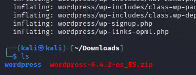

# Practica 1 Trimestre - Juan Manuel Guerrero
## Servidores Web

### 1. INSTALACION APACHE
<a name="instAp"></a>
Primero, instalamos apache con el comando:
```linux
sudo apt get install apache2
```

### 2. CONFIGURAR VIRTUALHOSTS
<a name="confVH"></a>
En el archivo _hosts_, escribiremos los nuevos hosts correspondientes:
Para acceder al archivo: ```sudo nano etc/hosts```


Ahora nos dirigimos a la terminal de nuevo y creamos los archivos _centro.intranet.conf_ y _departamentos.centro.intranet.conf_
en el fichero _sites-availables_:
```linux
sudo nano /etc/apache2/sites-available/centro.intranet.conf
sudo nano /etc/apache2/sites-available/departamentos.centro.intranet.conf
```
Y se nos abrirá el editor donde deberemos escribir lo siguiente:

**En centro.intranet.config:**
```xml                                                                            
<VirtualHost *:80>
  ServerAdmin webmaster@centro.intranet
  ServerName centro.intranet
  DocumentRoot /var/www/centro.intranet

  <Directory /var/www/centro.intranet/>
    Options Indexes FollowSymLinks
    AllowOverride All
    Require all granted
  </Directory>

  ErrorLog ${APACHE_LOG_DIR}/centro.intranet_error.log
  CustomLog ${APACHE_LOG_DIR}/centro.intranet_access.log combined
</VirtualHost>
```

**En departamentos.centro.intranet:**
```xml                                                                            
<VirtualHost *:80>
    ServerAdmin webmaster@departamentos.centro.intranet
    ServerName departamentos.centro.intranet
    DocumentRoot /var/www/departamentos.centro.intranet

    <Directory /var/www/departamentos.centro.intranet/>
        Options Indexes FollowSymLinks
        AllowOverride All
        Require all granted
    </Directory>

    ErrorLog ${APACHE_LOG_DIR}/departamentos.centro.intranet_error.log
    CustomLog ${APACHE_LOG_DIR}/departamentos.centro.intranet_access.log combined
</VirtualHost>
```

### Crear directorios
<a name="crearDir"></a>
Crearemos los directorios correspondientes a cada uno de los sitios en _var/www/_

```linux
sudo mkdir /var/www/centro.intranet
sudo mkdir /var/www/departamentos.centro.intranet
```

### Habilitar el módulo PHP
<a name="habPhp"></a>
Instalamos el módulo PHP en Apache:
```linux
sudo apt install libapache2-mod-php
```
```linux
sudo a2enmod php8.2(version que tengamos 'php -v')
```


### Habilitar el módulo MySql
<a name="habMSQL"></a>
Para habilitar el módulo MySql en PHP, haremos lo siguiente:
```linux
sudo apt install php-mysql
```
```linux
sudo systemctl restart apache2
```

### Activar MySql
<a name="activMSQL"></a>
Para ello, escribiremos lo siguiente:

```linux
sudo apt install mysql-server
```
Ahora vamos a entrar, escribiendo:
```linux
mysql -u root -p
```


Crearemos una base de datos llamada _PracticaJ_ por ejemplo:

```sql
CREATE DATABASE PracticaJ
```

Y veremos si se ha creado con la línea ```SHOW DATABASES```


### Instalar y activar WordPress

Descargaremos WordPress desde el sitio web oficial y descomprimiremos el archivo en _centro.intranet_, la página a la que queremos aplicar WordPress. 

Como podemos ver, el archivo está en la carpeta _Downloads_, para moverlo haremos lo siguiente:

Primero descomprimimos el archivo:
```linux
sudo unzip wordpress-6.4.2-es_ES.zip
```

Ahora para mover el archivo escribiremos:

```linux
sudo mv wordpress /var/www/centro.intranet/ 
```


Listo, ahora haremos unos ajustes para sacar el contenido de la carpeta wordpress y dejarla en centro.intranet.


Ahora debemos cambiar los permisos para que no surjan problemas durante la instalación.

```linux
sudo chown -R www-data:www-data /var/www/centro.intranet
```

Ahora accedemos a _http://centro.intranet_ y nos saldrá la instalación de WordPress.


### Instalar y activar Python

Para instalar pyhton, hay que instalar el módulo wsgi que se llevaría a cabo con el siguiente comando:

```linux
sudo apt install libapache2-mod-wsgi-py3
```


Activamos y reiniciamos apache.

```linux
sudo a2enmod wsgi
sudo service apache2 restart
```


### Crear una pequeña aplicación Python para comprobar y demostrar que funciona correctamente

En la carpeta departamentos.centro.intranet crearemos un archivo con la ejecución de python. 
```linux
(en la carpeta /var/www/departamentos.centro.intratnet)
sudo nano main.py
```
El codigo de mi programa sería algo así:
```python
print("Hola mundo!")

for i in range(1,6):
  print(f"Numero: {i}")
```

Ahora crearemos un archivo _WSGI_ en el mismo directorio.

```sudo nano main.wsgi```

Y en él escribimos el siguiente codigo:
```py
import sys
sys.path.insert(0, '/var/www/departamentos.centro.intranet')

from app import application

if __name__ == '__main__':
    application.run()
```

Damos los permisos:
```sudo chown -R www-data:www-data /var/www/departamentos.centro.intranet```

Listo ahora al abrir _http://departamentos.centro.intranet/_ nos saldrá en la página la ejecución del programa python que hemos programado previamente.

### Instala y configura AWSTATS

Para comenzar, instalaremos _awstats_:
```sudo apt install awstats```

Nos dirigimos a la configuración del mismo.
```sudo nano /etc/awstats/awstats.localhost.conf```


Ahora en el navegador nos dirigimos a: _http://127.0.0.1/cgi-bin/awstats.pl?config=localhost_ para acceder a las estadísticas


