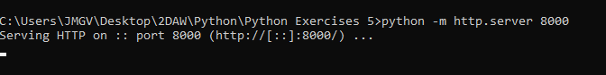
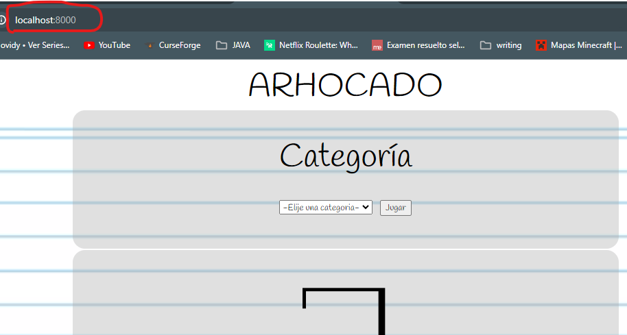
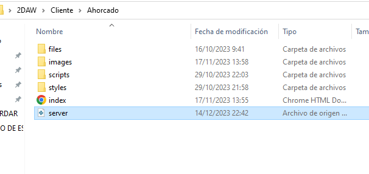
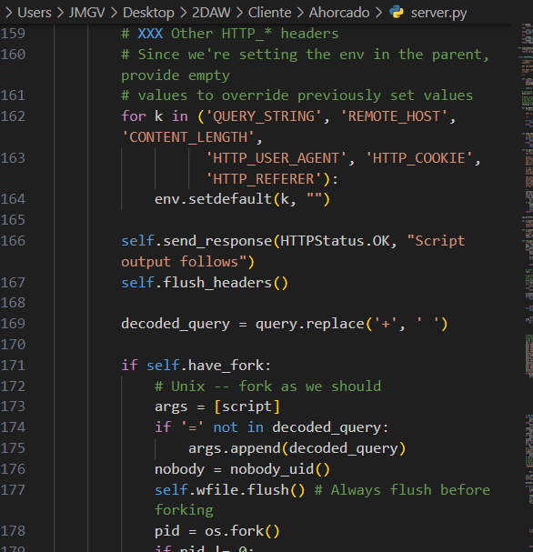
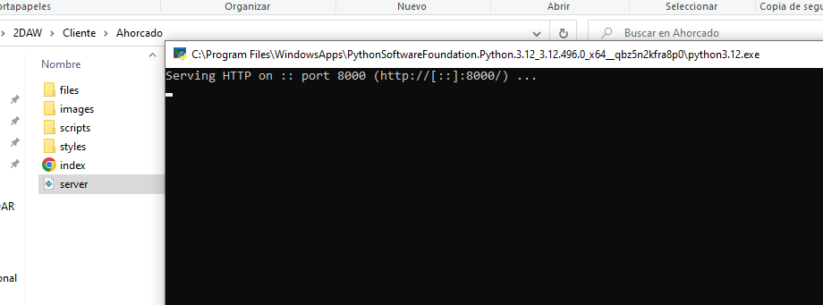

## Instalar Python
Instalamos Python desde la página oficial

Una vez descargado e instalado, nos dirigimos con la consola a nuestra carpeta contenedora del programa web y escribimos el siguiente comando:

```cmd
python -m http.server 8000
```

Escribimos en el navegador _localhost:8000_ y accedemos al recurso.


## HTTP Server

Conseguimos el recurso de HTTP Server a través de GitHub, del repositorio de _cpython_. [ENLACE](https://github.com/python/cpython/blob/main/Lib/http/server.py)

Una vez allí, copiamos el código y lo añadimos a un archivo llamado _server.py_ y movemos el archivo a la carpeta del recurso que queremos mostrar en el navegador.




Ahora solo damos doble clic en el archivo que acabamos de crear y listo, servidor operativo.



